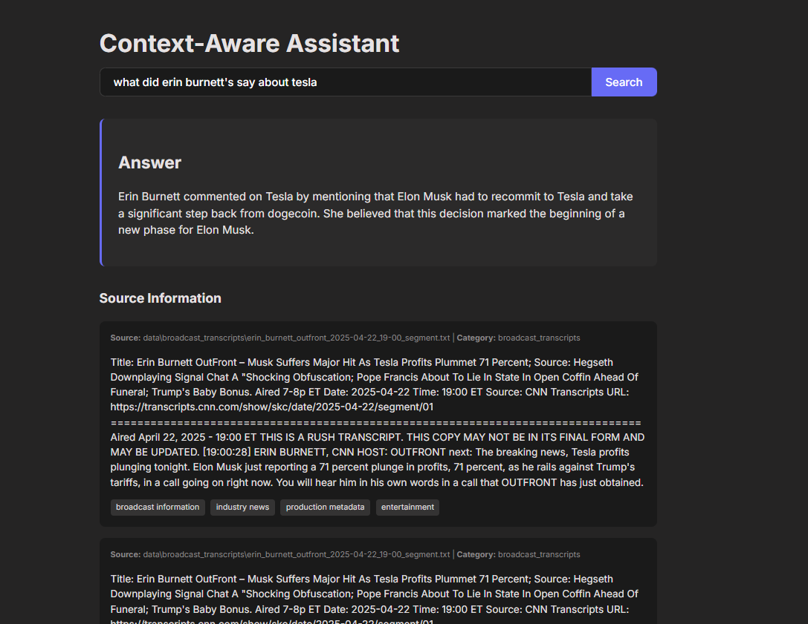

# Context-Aware Assistant

An AI assistant with RAG (Retrieval-Augmented Generation) capabilities, content classification, and external API integration through MCP (Model Context Protocol).  
🧠 Built using the ReACT (Reason + Act) framework for agent decision-making.

📽️ [Watch the Demo on Loom](https://www.loom.com/share/7e0992c92ae642c399d70e72de0e8d42?sid=0a34f6bd-9ed7-4036-9d20-42604a2e9890)




## Features

- **Static RAG**: Retrieves relevant information from multiple collections of documents
- **Hybrid Search**: Combines vector search and keyword search for better results
- **Content Classification**: Automatically classifies content using zero-shot learning
- **External API Integration**: Connects to TheSportsDB API for live sports data
- **LangChain Integration**: Uses LangChain for document loading and text splitting
- **Modern Frontend**: React-based UI for interacting with the assistant
- **Containerized Deployment**: Docker and Docker Compose setup for easy deployment

## System Architecture

```
┌─────────────┐     ┌─────────────┐     ┌─────────────┐
│   Frontend  │────▶│ Backend API │────▶│ ChromaDB    │
│  (React)    │     │  (FastAPI)  │     │(Vector DB)  │
└─────────────┘     └──────┬──────┘     └─────────────┘
                           │
                           ▼
                    ┌─────────────┐     ┌─────────────┐
                    │ MCP Server  │────▶│ TheSportsDB │
                    │  (FastAPI)  │     │    API      │
                    └─────────────┘     └─────────────┘
```

## Project Structure

```
context_aware_assistant/
├── data/                      # Data directories for different collections
│   ├── broadcast_transcripts/
│   ├── production_metadata/
│   ├── technical_docs/
│   └── industry_news/
├── mcp_server/                # MCP server for external API integration
│   └── main.py
├── frontend/                  # React frontend
│   ├── src/
│   │   ├── components/
│   │   │   ├── SearchBar.jsx
│   │   │   └── ResultsDisplay.jsx
│   │   ├── App.jsx
│   │   ├── main.jsx
│   │   └── index.css
│   ├── index.html
│   ├── package.json
│   └── vite.config.js
├── whoosh_index/              # Directory for Whoosh keyword search index
├── ingest.py                  # Data processing and embedding script
├── retriever.py               # Retrieval logic for vector and keyword search
├── classifier.py              # Content classification using zero-shot learning
├── agent.py                   # Agent logic and LLM integration
├── main.py                    # Main backend API
├── requirements.txt           # Python dependencies
├── .env                       # Environment variables
├── Dockerfile.backend         # Dockerfile for the backend
├── Dockerfile.mcp             # Dockerfile for the MCP server
├── Dockerfile.frontend        # Dockerfile for the frontend
└── docker-compose.yml         # Docker Compose configuration
```

## Getting Started

### Prerequisites

- Python 3.9+
- Node.js 18+
- Docker and Docker Compose (for containerized deployment)

### Local Development Setup

1. Clone the repository:
   ```
   git clone <repository-url>
   cd context_aware_assistant
   ```

2. Set up the Python virtual environment:
   ```
   **Use a dedicated venv (recommended)**
   Create a fresh virtualenv in your project root:  
   ```bash
   python -m venv .venv
   ```  
   Activate it:  

   **Windows (PowerShell)**  
   ```powershell
   .\.venv\Scripts\Activate.ps1
   ```  

   **Windows (cmd.exe)**  
   ```cmd
   .\.venv\Scripts\activate.bat
   ```  

   Re-install your requirements:  
   ```bash
   pip install --upgrade pip
   pip install -r requirements.txt
   ```
   ```

3. Set up environment variables:
   - Create a `.env` file in the project root with the following configuration:
   ```
   # API Keys
   SPORTS_DB_API_KEY="3"  # API key for the TheSportsDB custom MCP server
   OPENAI_API_KEY="your_openai_api_key_here"

   # Database Configuration
   CHROMA_HOST=localhost
   CHROMA_PORT=8000

   # Server Configuration
   MCP_SERVER_PORT=8001
   MAIN_SERVER_PORT=8002

   # LLM Configuration
   OPENAI_MODEL=gpt-3.5-turbo
   ```
   - Replace `your_openai_api_key_here` with your actual OpenAI API key
   - Note: The sports data API key "3" is already set for the TheSportsDB custom MCP server

4. Run ChromaDB:
   ```
   docker run -d -p 8000:8000 --name chroma_db chromadb/chroma
   ```

5. Process and index data:
   ```
   python ingest.py
   ```

6. Start the MCP server:
   ```
   uvicorn mcp_server.main:app --reload --port 8001
   ```

7. Start the backend API:
   ```
   uvicorn main:app --reload --port 8002
   ```

8. Set up and run the frontend:
   ```
   cd frontend
   npm install
   npm run dev
   ```

### Docker Deployment

To deploy the entire application using Docker Compose:

```
docker-compose up -d
```

This will start all services:
- ChromaDB on port 8000
- MCP Server on port 8001
- Backend API on port 8002
- Frontend on port 80

## Usage

1. Open your browser and navigate to `http://localhost:3000` (for local development) or `http://localhost` (for Docker deployment)
2. Enter your query in the search bar
3. The assistant will retrieve relevant information, classify it, fetch live data if needed, and generate a response

## Adding Your Own Data

To add your own data to the system:

1. Place your text files, JSON files, or other supported formats in the appropriate data subdirectory:
   - `data/broadcast_transcripts/` for broadcast-related content
   - `data/production_metadata/` for production metadata
   - `data/technical_docs/` for technical documentation
   - `data/industry_news/` for news articles

2. Run the ingestion script to process and index the data:
   ```
   python ingest.py
   ```

## Customization

- **OpenAI Model**: You can change the OpenAI model in the `.env` file by updating the `OPENAI_MODEL` variable (e.g., "gpt-4" for better quality)
- **OpenAI Parameters**: Adjust temperature, max_tokens, and other parameters in the `run_query` function in `agent.py`
- **Embedding Model**: The embedding model can be changed in `ingest.py` and `retriever.py`
- **Classification Labels**: Update the `DEFAULT_LABELS` in `classifier.py` to customize content classification

## License

[MIT License](LICENSE)

## Implementation Plan

The project follows a phased implementation approach:

### Phase 1: Foundation & Data Preparation (Static RAG)
- Project setup with Python environment and dependencies
- ChromaDB setup for vector database
- Data collection and preparation for the four collections
- Data processing and embedding using sentence transformers
- Indexing data into ChromaDB

### Phase 2: Core Service Development (MCP & Retrieval)
- MCP server development for sports data integration
- Retrieval logic implementation with vector search
- Hybrid retrieval with Whoosh for keyword search fallback
- Content classification implementation

### Phase 3: Agent Logic & LLM Integration
- Agent logic design and implementation
- LLM setup and integration
- Synthesis step implementation for generating responses

### Phase 4: API & Frontend
- Backend API development with FastAPI
- React frontend development
- Connection between frontend and backend

### Phase 5: Deployment & Observability
- Dockerization of services
- Docker Compose setup
- Logging implementation
- Metrics collection (optional)
- Testing
- Kubernetes deployment (optional)

**Note:** Due to time constraints, no actual data was used for the production metadata or industry news collections. The system is set up to handle these data types, but they are currently empty placeholders.
